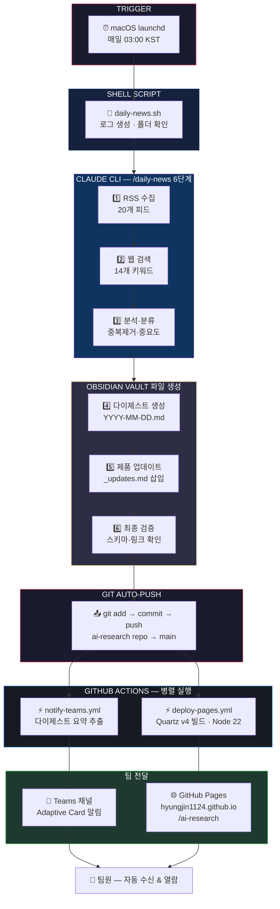
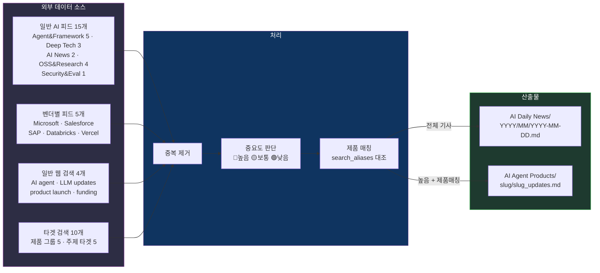
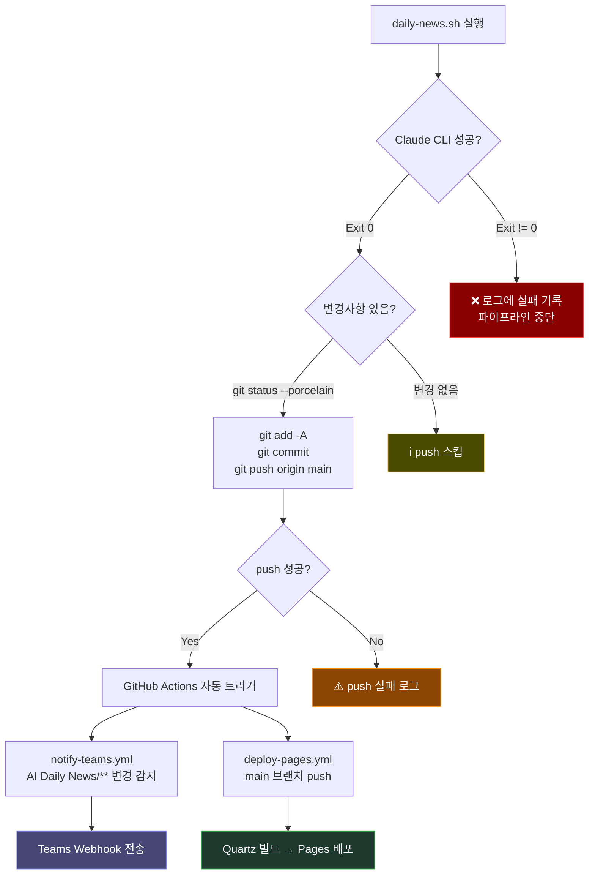

# AI Daily News — E2E 자동화 플로우

## 전체 파이프라인

## 데이터 흐름 상세

## 컴포넌트 매핑

| 컴포넌트 | 파일 위치 | 역할 |
|----------|----------|------|
| **launchd** | `~/.claude/scripts/com.konachain.daily-news.plist` | 매일 03:00 KST 스케줄 트리거 |
| **Shell Script** | `~/.claude/scripts/daily-news.sh` | Claude CLI 호출 + Git auto-push |
| **Claude 커맨드** | `~/.claude/commands/daily-news.md` | 6단계 수집·분석·생성 워크플로 |
| **컨텍스트 (뉴스)** | `AI Daily News/_CONTEXT.md` | 구조 규칙, RSS 목록, Frontmatter 스키마 |
| **컨텍스트 (제품)** | `AI Agent Products/_CONTEXT.md` | 제품 레지스트리, search_aliases |
| **템플릿** | `AI Daily News/_TEMPLATE_daily-digest.md` | 다이제스트 파일 구조 |
| **Teams 알림** | `.github/workflows/notify-teams.yml` | Adaptive Card via Webhook |
| **웹 배포** | `.github/workflows/deploy-pages.yml` | Quartz v4 + GitHub Pages |
| **랜딩 페이지** | `index.md` | Quartz 사이트 홈 |

## 트리거 조건

